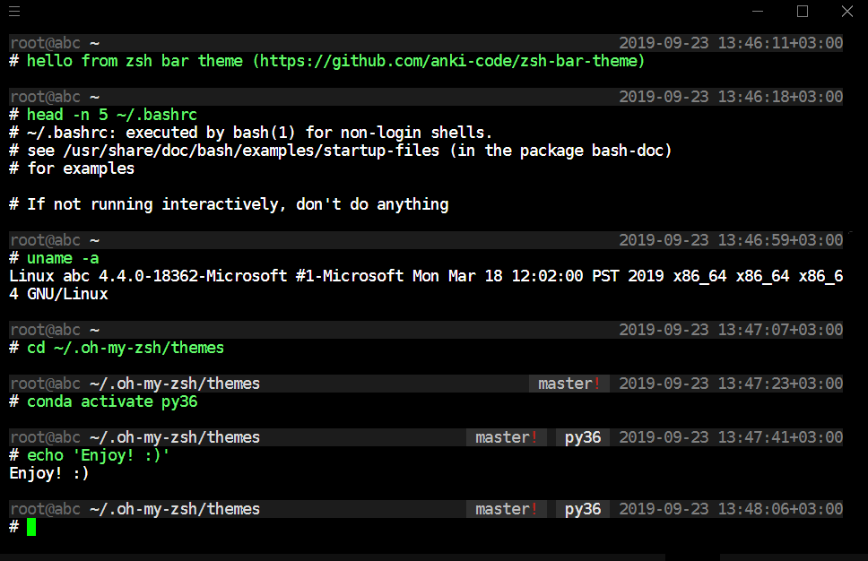

## Bar theme for zsh

Features:

* It looks not like Christmas tree. Most of OMZ themes look like 🎄 💈 Christmas garland and frustrate attention. But terminal is most for write commands and get output, not for color juggling 🖥 

* It has three attention aspects by priority: first - command and path, second - output, third - pills/sections 👓 

* It has a bar along all space and it is a great separator ⬛️ 

* The command beginning has fixed position and command has color with intensity. It's great for reading and typing 💚 

* The pills/sections placed to right but not in RPROMPT and it allows you to secure copy the command and output without environmental disclosure 🔒 

## Example



Screeshot from [Hyper](https://hyper.is) with [One Dark](https://www.npmjs.com/package/hyperterm-atom-dark) and [Fira Code](https://github.com/tonsky/FiraCode) or something like this.

## Install
```
git clone https://github.com/anki-code/zsh-bar-theme ~/.oh-my-zsh/custom/themes/zsh-bar-theme
ln -s ~/.oh-my-zsh/custom/themes/zsh-bar-theme/bar.zsh-theme ~/.oh-my-zsh/custom/themes/bar.zsh-theme
sed -i  's/^ZSH_THEME=/ZSH_THEME="bar"\n#ZSH_THEME=/g' ~/.zshrc
<restart zsh>
```
